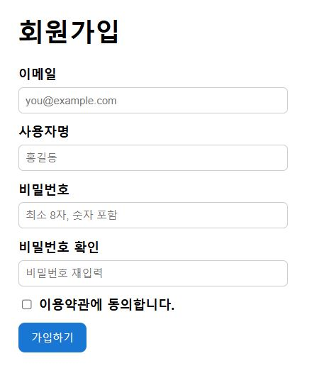
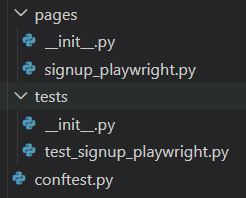
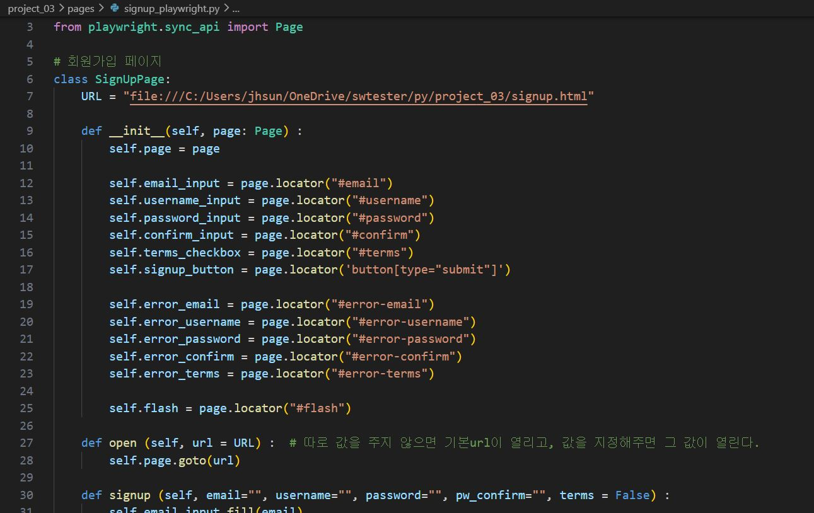
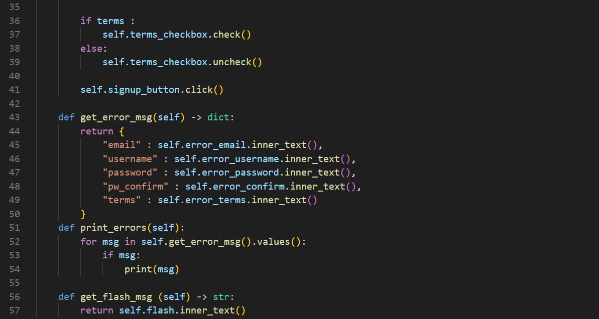

# Playwright 활용 회원가입 테스트

### 🔹 개요

웹 애플리케이션의 회원가입 기능을 Playwright를 활용하여 자동화 테스트를 구현했다. 

---

### 🔹 목표

- 회원가입 기능의 정상 동작 여부를 자동으로 검증한다.
- 입력값 유효성 검사(Validation)가 올바르게 동작하는지 확인한다.
- 다양한 사용자 입력 케이스를 효율적으로 테스트한다.
- 테스트 코드의 유지보수성과 확장성을 고려하여 Page Object Model(POM) 구조와 데이터 기반 테스트 방식을 적용한다.
- Playwright 기반의 실무형 자동화 구조 설계 경험 확보한다.

---

### 🔹 테스트 자동화 시나리오 설계
대상: 웹 서비스 회원가입 페이지
1. 이메일 입력
2. 사용자명 입력
3. 비밀번호 입력
4. 비밀번호 확인 입력
5. 약관동의 체크
6. 회원가입 버튼 클릭
7. 유효성 검사 메시지 출력

---

### 🔹 테스트 범위

- 정상 회원가입
- 이메일 형식 검증
- 비밀번호 조건 검증 (길이, 특수문자 등)
- 비밀번호/비밀번호 확인 일치 여부
- 필수 입력값 누락 케이스
- 성공/실패 메시지 검증

---
### 🔹 테스트 설계

#### 📂 Page Object Model(POM) 폴더 구조

1. 설계 방식

테스트는 Page Object Model(POM) 구조를 기반으로 설계하였다.

2. 테스트 관점
 - 기능 관점
  회원가입이 정상적으로 완료되는가
  입력값 검증 관점
  잘못된 입력값에 대해 적절한 에러 메시지가 출력되는가
 - 사용자 경험 관점
  오류 메시지가 명확하게 제공되는가

3. 테스트 시나리오
  1. 정상 회원가입
        - 유효한 이메일, 사용자명, 비밀번호 입력
        - 회원가입 성공 메시지 확인
  2. 이메일 형식 오류
        - 잘못된 이메일 입력 (@대신 다른 특수문자 사용, 빈칸 입력 등)
        - "이메일 형식 오류" 메시지 확인
  3. 비밀번호 조건 미충족
        - 짧은 비밀번호, 숫자나 영어 한가지만 입력
        - 조건 미충족 메시지 확인
  4. 비밀번호 불일치
        - 비밀번호 ≠ 비밀번호 확인
        - 오류 메시지 확인 
  5. 필수값 누락
        - 이메일 또는 비밀번호 미입력
        - 필수 입력 메시지 확인
     
---

### 🔹 자동화 구현 과정

#### 🔎 페이지 객체 설계

👉 회원가입 페이지를 하나의 클래스로 구성하여 메서드를 정의하였다.

#### 🔎 공통 실행 환경 구성

👉`conftest.py`에서 Pytest fixture를 사용해 Playwright 환경 구성하였다.

#### 📝 테스트 코드 작성
