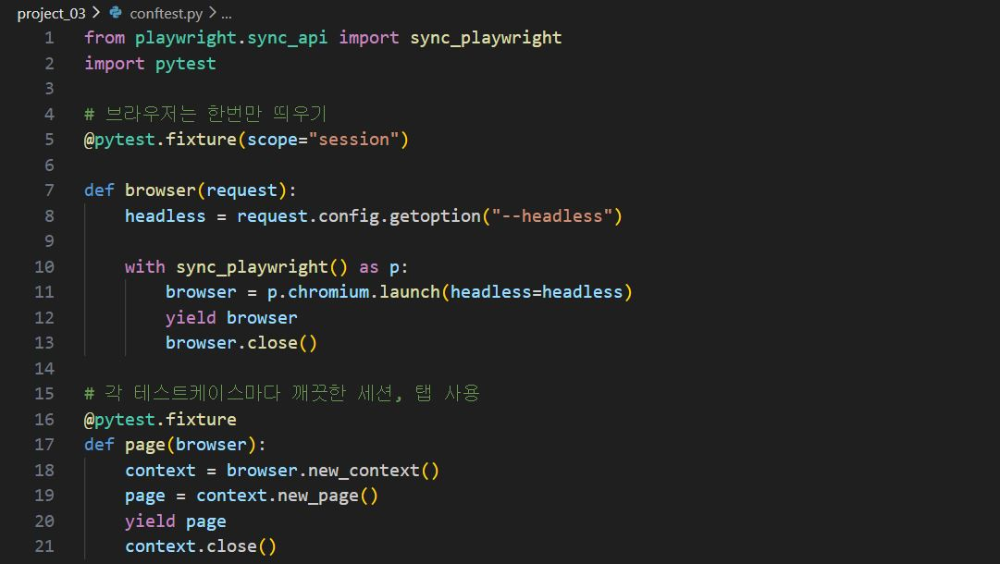
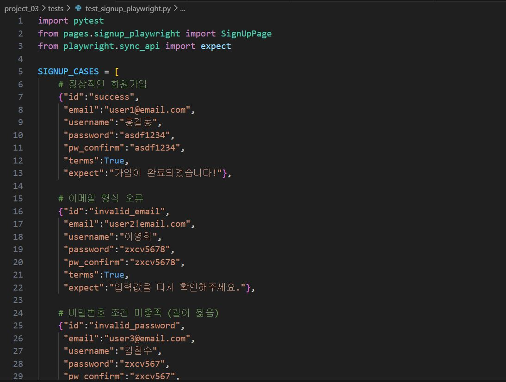
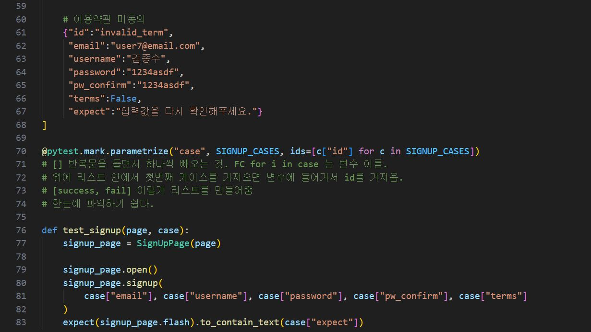
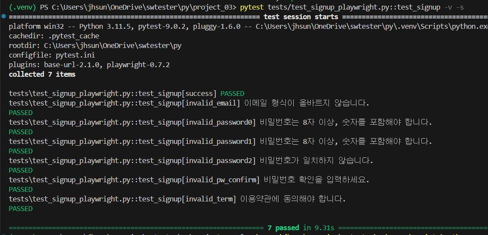

# Playwright 활용 회원가입 테스트

### 🔹 개요

웹 애플리케이션의 회원가입 기능을 Playwright를 활용하여 자동화 테스트를 구현했다. 

---

### 🔹 목표

- 회원가입 기능의 정상 동작 여부를 자동으로 검증한다.
- 입력값 유효성 검사(Validation)가 올바르게 동작하는지 확인한다.
- 다양한 사용자 입력 케이스를 효율적으로 테스트한다.
- 테스트 코드의 유지보수성과 확장성을 고려하여 Page Object Model(POM) 구조와 데이터 기반 테스트 방식을 적용한다.
- Playwright 기반의 실무형 자동화 구조 설계 경험 확보한다.

---

### 🔹 테스트 자동화 시나리오 설계
대상: 웹 서비스 회원가입 페이지
1. 이메일 입력
2. 사용자명 입력
3. 비밀번호 입력
4. 비밀번호 확인 입력
5. 약관동의 체크
6. 회원가입 버튼 클릭
7. 유효성 검사 메시지 출력

---

### 🔹 테스트 범위

- 정상 회원가입
- 이메일 형식 검증
- 비밀번호 조건 검증 (길이, 특수문자 등)
- 비밀번호/비밀번호 확인 일치 여부
- 필수 입력값 누락 케이스
- 성공/실패 메시지 검증

---
### 🔹 테스트 설계

#### 📂 Page Object Model(POM) 폴더 구조

1. 설계 방식

테스트는 Page Object Model(POM) 구조를 기반으로 설계하였다.

2. 테스트 관점
 - 기능 관점
  회원가입이 정상적으로 완료되는가
  입력값 검증 관점
  잘못된 입력값에 대해 적절한 에러 메시지가 출력되는가
 - 사용자 경험 관점
  오류 메시지가 명확하게 제공되는가

3. 테스트 시나리오
  1. 정상 회원가입
        - 유효한 이메일, 사용자명, 비밀번호 입력
        - 회원가입 성공 메시지 확인
  2. 이메일 형식 오류
        - 잘못된 이메일 입력 (@대신 다른 특수문자 사용, 빈칸 입력 등)
        - "이메일 형식 오류" 메시지 확인
  3. 비밀번호 조건 미충족
        - 짧은 비밀번호, 영어만 입력
        - 조건 미충족 메시지 확인
  4. 비밀번호 불일치
        - 비밀번호 ≠ 비밀번호 확인
        - 오류 메시지 확인 
  5. 필수값 누락
        - 이메일 또는 비밀번호 미입력
        - 필수 입력 메시지 확인
     
---

### 🔹 자동화 구현 과정

#### 🔎 페이지 객체 설계

👉 회원가입 페이지를 하나의 클래스로 구성하여 메서드를 정의하였다.
    
---

#### 🔎 공통 실행 환경 구성

👉`conftest.py`에서 Pytest fixture를 사용해 Playwright 환경 구성하였다.
    
---

#### 📝 테스트 코드 작성

👉 정상적인 회원가입, 비정상적인 회원가입을 진행하였다. `parameterize`를 사용하여 테스트케이스를 구성하여 하나의 테스트 구조로 처리할 수 있게 구현했다.

---

### 🔹 결함
- 비밀번호 숫자로 8자리로 구성할 경우 가입할 수 있다.

---

### 🔹 결과
- 다양한 회원가입 시나리오에 대해 자동화 테스트 수행
- 정상/비정상 입력 케이스 모두 검증 가능
- 테스트 코드 재사용성과 확장성 확보
- 반복 테스트 수행 시간 단축

👉 페이지 객체, 공통 fixture, 데이터 기반 테스트 구조로 나누어 작성함으로써 재사용성과 가독성을 높인 자동화 구조를 구현했다.

---

### 🔹 아쉬운 점 및 보완점
- 사용자명 조건이 명확하지 않아서 한글이외에 영어, 빈칸, 특수문자등을 사용해도 오류가 없던 점이 개선이 필요
- 비밀번호 조건이 '최소 8자, 숫자포함' 이라고 적혀있어서 영어, 한글, 특수문자, 숫자 어디까지 허용되는지 명확한 명시가 필요.
- 로컬 홈페이지를 이용한 프로젝트라서 중복된 이메일, 중복된 사용자를 확인할 수 없는 등의 한계가 존재
- 경계값 테스트 부족 -> 다양한 비밀번호 정책 테스트 추가 필요

---

### 🎯 프로젝트를 통해 배운 점
- Playwright를 활용해 안정적인 테스트 구현
- POM 구조로 유지보수성 확보
- parameterize를 통한 데이터 기반 테스트 구성
- 다양한 예외 케이스를 포함한 테스트 설계

👉 자동화 테스트는 테스트 설계 + 구조 설계 + 유지보수 전략이 중요하다는 것을 학습하였다. Playwright를 활용하면 Selenium 대비 안정적인 테스트 환경을 구축할 수 있다는걸 배웠고, 다양한 입력 검증 시나리오를 데이터 기반으로 설계하여 유지보수 가능한 테스트 구조를 이해하고 POM 구조의 중요성을 실무 관점에서 이해할 수 있었다.
